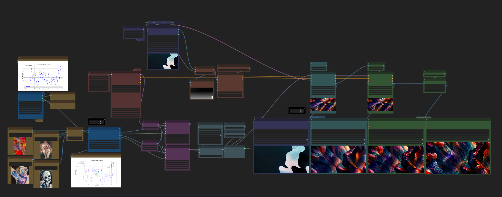
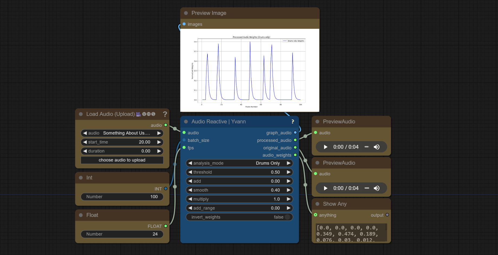
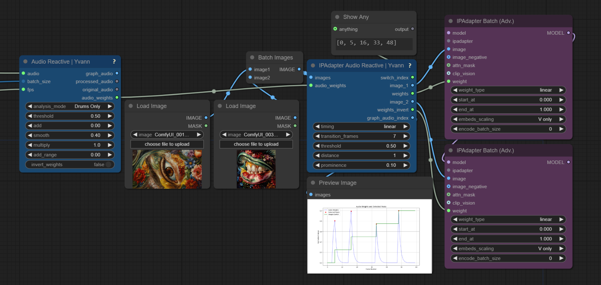
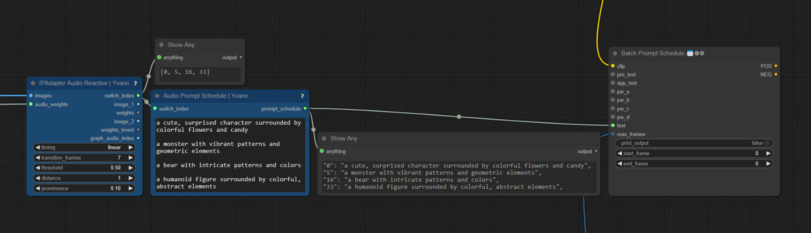
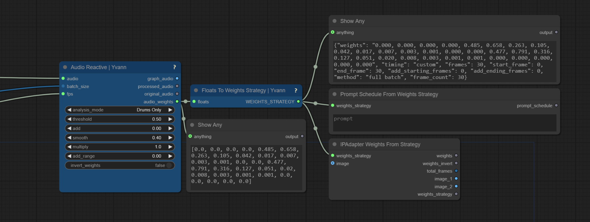
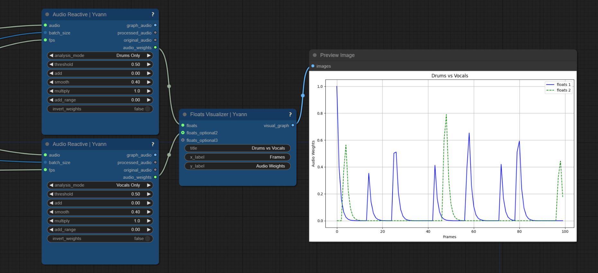
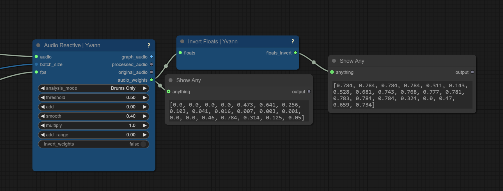

# 👁️ ComfyUI_Yvann-Nodes   

#### Made with the help of [Lilien](https://github.com/Lilien86) 

#### **With this pack of nodes, you can analyze audio, extract drums, bass, vocal tracks, and use the scheduled masks and weights to create AI generated audio-reactive animations in ComfyUI**

#### **Works with IPAdapter, AnimateDiff, ControlNets, Prompts Schedules**

- [Workflows](#Workflows)
- [Nodes](#Nodes)
- [Installation](#Installation)

--- 

## Workflows

### AudioReactive Vid2Vid IPAdapter-Switch sd15-8steps :

##### Workflow Demo Render *(ENABLE VIDEO SOUND)* 🔊

https://github.com/user-attachments/assets/6b0aa544-aa20-4257-b6be-28673082c7ef

##### Workflow File (download it and drop it into ComfyUI) 📜
[AudioReactive_Vid2Vid_IPAdapter-Switch_sd15-8steps_YVANN.json](./AudioReactive_Workflows/AudioReactive_Vid2Vid_IPAdapter-Switch_sd15-8steps_YVANN.json)

##### Youtube Tutorial (Click on the image)

##### Workflow Preview

[CIVITAI Workflow Page](https://civitai.com/models/867298)

##### Details ☝️🤓
Synchronize any number of image inputs with audio input (e.g., switch images based on bass or drums) throught your animation, with the help of IPAdapter to diffuse the style of your audio reactive input images. There are also ControlNet included to control the composition of your animation based on an input video, making styles and shapes audio-reactive and controlable. The workflow uses Stable Diffusion 1.5 and HyperSD (8 steps) for efficient, high-quality animations, even on a low VRAM/GPU setup

---
## Nodes

#### Audio Reactive 🔊

Analyzes audio input to generate **audio-reactive weights** and visualizations. It can extract specific elements from the audio, such as **drums**, **vocals**, **bass**, or analyze the **full audio**. Using AI-based audio separator [open-unmix](https://github.com/sigsep/open-unmix-pytorch), it separates these components from the input audio

>

>  
<i>Node Parameters</i>

>
>  - **batch_size**: The number of audio frames to process
>  - **fps**: Frames per second for processing audio weights, the output of your animation need to have the same fps to be correctly synchronized
>  - **audio**: Input audio file
>  - **analysis_mode**: Selects the audio component to analyze (**Drums Only**, **Full Audio**, **Vocals Only**, **Bass Only**, **Other Audio**). This analysis is performed using AI-based audio separation models (open-unmix)
>  - **threshold**: Filters the audio weights based on sound intensity (only values above the threshold pass through)
>  - **add**: Adds a constant value to all the weights
>  - **smooth**: Smoothing factor to reduce sharp transitions between weights
>  - **multiply**: Multiplication factor to amplify the weights
>  - **add_range**: Expands the range of the weights to control output dynamic range
>  - **invert_weights**: Inverts the audio weights
>
>  **Outputs**:
>  - **graph_audio**: An image displaying a graph of the audio weights over time, representing the variation in intensity across the analyzed frames
>  - **processed_audio**: The separated or processed audio (e.g., drums, vocals) used in the analysis
>  - **original_audio**: The original audio input without modifications
>  - **audio_weights**: A float list of audio-reactive weights based on the processed audio
>
>

---

#### IPAdapter Audio Reactive 🎵

Receives "audio-reactive weights" from the "Audio Reactive Node" to control the blending and switch between images based on audio peaks. Return images and associed weights to use with 2 IPadapter Batch, inspired by the "IPAdapter Weights" from [IPAdapter_Plus](https://github.com/cubiq/ComfyUI_IPAdapter_plus)

>

>  
<i>Node Parameters</i>

>
>  - **images**: A batch of images used as sources for transitions, each images switch when a peak occurs in the audio (when you see a red dots in the graph)
>  - **audio_weights**: A list of audio-reactive weights used to control image blending, received from "Audio Reactive Node"
>  - **timing**: Timing function for blending, each mode smooth the weights in a differents way, to understand what they're doing just display the audio weights you will see differents smoothed values
>  - **transition_frames**: The number of frames over which to blend between images, I recommend lower low values when you have a low frame rate and high value when you have a high frame rate
>  - **threshold**: The minimum height required for a peak in the audio to be considered, look at the graph to understand
>  - **distance**: The minimum number of frames between peaks, useful when you have small peaks near a big peak and you want only the big peak, you can kind of ignore the small peaks around by increasing the distance
>  - **prominence**: The relative importance of a peak (not really important lol)
>
>  **Outputs**:
>  - **switch_index**: Each frame indices at which image transitions occur, useful only in the case you want to have a scheduled prompt based on the peak of your audio, in this case connect this output to my node "Audio Prompt Schedule"
>  - **image_1**: The starting image for a transition, connect it to the first IPadapter batch in the image input
>  - **weights**: The calculated blending weights for image transitions, connect it to the first IPadapter batch in the weight input
>  - **image_2**: The ending image for a transition, connect it to the second IPadapter batch in the image input
>  - **weights_invert**: The inverse of the calculated blending weights, connect it to the second IPadapter batch in the weight input
>  - **graph_audio_index**: An image visualization of audio weights, detected peaks, and image transitions
>
>

---

#### Audio Prompt Schedule 📝

Associates Inputs prompts with inputs floats into a scheduled prompt format. The output of this node need to be connected to a batch prompt schedule from [Fizz Nodes](https://github.com/FizzleDorf/ComfyUI_FizzNodes)

>

>  
<i>Node Parameters</i>

>
>  - **switch_index**: A list of indices where prompts will change (required, type FLOAT)
>  - **prompts**: A multiline string of prompts to be used at each index (type STRING, default: empty)
>
>  **Outputs**:
>  - **prompt_schedule**: A string representation of the prompt schedule. Each audio reactive index is associated with a prompt from the provided list
>
>

---

#### Floats To Weights Strategy 🏋️

Convert a list of floats into an IPAdapter weights strategy, enabling use with "IPAdapter Weights From Strategy" or "Prompt Schedule From Weights Strategy". This allows to pass audio_weights or any float list to the IPAdapter pipeline

>

>  
<i>Node Parameters</i>

>
>  - **floats**: The list of float values to be converted into a weights strategy
>  - **batch_size**: The number of frames you want to proceed
>
>  **Outputs**:
>  - **WEIGHTS_STRATEGY**: A dictionary containing the weights strategy used by IPAdapter, including the weights and related parameters
>
>

---

#### Floats Visualizer 📈

Generates a graph from one or more lists of floats to visually compare data. Useful for comparing audio weights from different Audio Reactive nodes

>

>  
<i>Node Parameters</i>

>
>  - **floats**: The primary list of float values to visualize
>  - **title**: Title of the graph
>  - **x_label**: Label for the x-axis
>  - **y_label**: Label for the y-axis
>  - **floats_optional2**: (Optional) A second list of float values to include in the visualization
>  - **floats_optional3**: (Optional) A third list of float values to include in the visualization
>
>  **Outputs**:
>  - **visual_graph**: An image displaying the graph of the provided float sequences
>
>

---

#### Mask To Float 🎭

Converts mask(s) input into float(s) value(s) by computing the mean pixel value of each mask

>

>  
<i>Node Parameters</i>

>
>  - **mask**: The mask input from which to compute the float value
>
>  **Outputs**:
>  - **float**: A float representing the average value of the mask
>
>

---

#### Invert Floats 🔁

Inverts all the individuals values of a list of floats

>

>  
<i>Node Parameters</i>

>
>  - **floats**: The list of float values to invert
>
>  **Outputs**:
>  - **floats_invert**: The inverted list of float values, where all the individual values have been inversed
>
>

---

### Installation
1. Install [ComfyUI](https://github.com/comfyanonymous/ComfyUI) & [ComfyUI-Manager](https://github.com/ltdrdata/ComfyUI-Manager)
2. Launch ComfyUI
3. Click on "🧩 Manager" -> "Custom Nodes Manager"
4. Search for `ComfyUI_Yvann-Nodes` in the manager and install it

---

You can find easily all my nodes in ComfyUI by 2x left click on mouse when you're on ComfyUI Canva and type "yva" in the search box

---
#### *Giving a ⭐ to this repo is the best way to support us (:*
