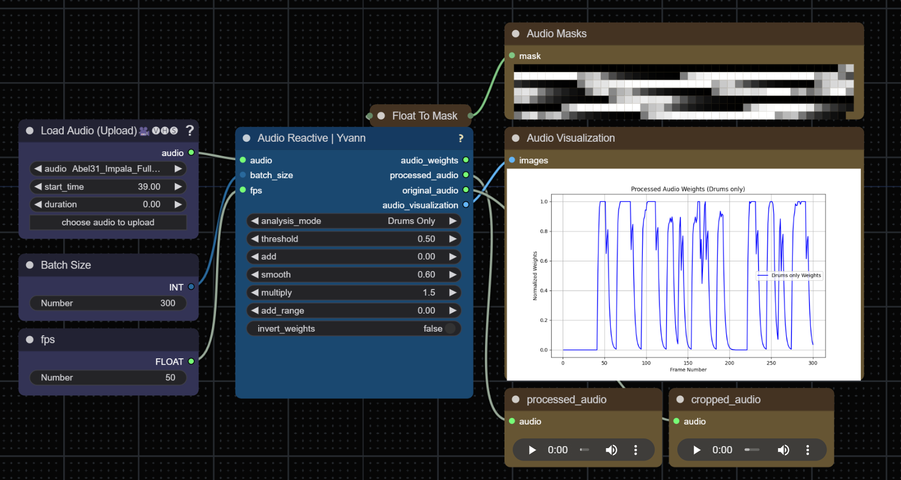

# 👁️ ComfyUI_Yvann-Nodes   

### **With this pack of nodes, you can analyze audio, extract drums, bass, vocal tracks, and use the scheduled masks and weights to create audio-reactive animations in ComfyUI**

#### **Works with IPAdapter, AnimateDiff, ControlNets, Prompts Schedules**

- **[Workflows](#Workflows)**
- **[Nodes](#Nodes)**
- **[Installation](#Installation), [Contributing](#Contributing)**

--- 

# Workflows

**In Progress**

---
# Nodes

### Audio Reactive 🔊

Analyzes audio input to generate **audio-reactive weights** and visualizations. It can extract specific elements from the audio, such as **drums**, **vocals**, **bass**, or analyze the **full audio**. Using AI-based audio separator [open-unmix](https://github.com/sigsep/open-unmix-pytorch), it separates these components from the input audio

>

>  
<i>Node Parameters</i>

>
>  - **batch_size**: The number of audio frames to process
>  - **fps**: Frames per second for processing audio weights, the output of your animation need to have the same fps to be correctly synchronized
>  - **audio**: Input audio file
>  - **analysis_mode**: Selects the audio component to analyze (**Drums Only**, **Full Audio**, **Vocals Only**, **Bass Only**, **Other Audio**). This analysis is performed using AI-based audio separation models (open-unmix)
>  - **threshold**: Filters the audio weights based on sound intensity (only values above the threshold pass through)
>  - **add**: Adds a constant value to all the weights
>  - **smooth**: Smoothing factor to reduce sharp transitions between weights
>  - **multiply**: Multiplication factor to amplify the weights
>  - **add_range**: Expands the range of the weights to control output dynamic range
>  - **invert_weights**: Inverts the audio weights
>
>  **Outputs**:
>  - **audio_weights**: A float list of audio-reactive weights based on the processed audio
>  - **processed_audio**: The separated or processed audio (e.g., drums, vocals) used in the analysis
>  - **original_audio**: The original audio input without modifications
>  - **audio_visualization**: An image displaying a graph of the audio weights over time, representing the variation in intensity across the analyzed frames
>
>

---

### IPAdapter Audio Reactive 🎵

Receives "audio-reactive weights" from the "Audio Reactive Node" to control the blending and switch between images based on audio peaks. Return images and associed weights to use with 2 IPadapter Batch, inspired by the "IPAdapter Weights" from [IPAdapter_Plus](https://github.com/cubiq/ComfyUI_IPAdapter_plus)

>

>  
<i>Node Parameters</i>

>
>  - **audio_weights**: A list of audio-reactive weights used to control image blending
>  - **images**: A batch of images as a tensor, used as sources for transitions (required, type IMAGE)
>  - **timing**: Timing function for blending (choices: custom, linear, ease_in_out, ease_in, ease_out, random; default: linear)
>  - **transition_frames**: The number of frames over which to blend between images (type INT, default: 7, min: 1, step: 1)
>  - **threshold**: The minimum height required for a peak to be considered (type FLOAT, default: 0.5, min: 0.0, max: 1.0, step: 0.01)
>  - **distance**: The minimum number of frames between peaks (type INT, default: 1, min: 1, step: 1)
>  - **prominence**: The relative importance of a peak (type FLOAT, default: 0.1, min: 0.0, max: 1.0, step: 0.01)
>
>  **Outputs**:
>  - **weights**: The calculated blending weights for image transitions
>  - **weights_invert**: The inverse of the calculated blending weights
>  - **image_1**: The starting image for a transition
>  - **image_2**: The ending image for a transition
>  - **prompt_index**: The frame indices at which image transitions occur
>  - **visualization**: An image visualization of audio weights, detected peaks, and image transitions
>
>

---

### Audio Prompt Schedule 📝

Associates Inputs prompts with inputs floats into a scheduled prompt format. The output of this node need to be connected to a batch prompt schedule from [Fizz Nodes](https://github.com/FizzleDorf/ComfyUI_FizzNodes)

>

>  
<i>Node Parameters</i>

>
>  - **prompt_indices**: A list of indices where prompts will change (required, type FLOAT)
>  - **prompts**: A multiline string of prompts to be used at each index (type STRING, default: empty)
>
>  **Outputs**:
>  - **prompt_schedule**: A string representation of the prompt schedule. Each index is associated with a prompt from the provided list
>
>

---

### Floats To Weights Strategy 🏋️

Convert a list of floats into an IPAdapter weights strategy, enabling use with "IPAdapter Weights From Strategy" or "Prompt Schedule From Weights Strategy". This allows to pass audio_weights or any float list to the IPAdapter pipeline

>

>  
<i>Node Parameters</i>

>
>  - **floats**: The list of float values to be converted into a weights strategy
>  - **batch_size**: The number of frames you want to proceed
>
>  **Outputs**:
>  - **WEIGHTS_STRATEGY**: A dictionary containing the weights strategy used by IPAdapter, including the weights and related parameters
>
>

---

### Floats Visualizer 📈

Generates a graph from one or more lists of floats to visually compare data. Useful for comparing audio weights from different Audio Reactive nodes

>

>  
<i>Node Parameters</i>

>
>  - **floats**: The primary list of float values to visualize
>  - **title**: Title of the graph
>  - **x_label**: Label for the x-axis
>  - **y_label**: Label for the y-axis
>  - **floats_optional2**: (Optional) A second list of float values to include in the visualization
>  - **floats_optional3**: (Optional) A third list of float values to include in the visualization
>
>  **Outputs**:
>  - **visual_graph**: An image displaying the graph of the provided float sequences
>
>

---

### Mask To Float 🎭

Converts mask(s) input into float(s) value(s) by computing the mean pixel value of each mask

>

>  
<i>Node Parameters</i>

>
>  - **mask**: The mask input from which to compute the float value (required, type MASK)
>
>  **Outputs**:
>  - **float**: A float representing the average value of the mask. This output is especially useful for analyzing or comparing different mask areas quantitatively
>
>

---

### Invert Floats 🔁

Inverts all the individuals values of a list of floats

>

>  
<i>Node Parameters</i>

>
>  - **floats**: The list of float values to invert
>
>  **Outputs**:
>  - **floats_invert**: The inverted list of float values, where all the individual values have been inversed
>
>

---

## Installation
1. Install [ComfyUI](https://github.com/comfyanonymous/ComfyUI) & [ComfyUI-Manager](https://github.com/ltdrdata/ComfyUI-Manager)
2. Launch ComfyUI
3. Click on "🧩 Manager" -> "Custom Nodes Manager"
4. Search for `ComfyUI_Yvann-Nodes` in the manager and install it

---

**You can find easily all my nodes in ComfyUI by 2x left click on mouse when you're on Comfy and type "yva" in the search box (:**

---
## Contributing
Want to help make this project better? Feel free to:
- Open an issue
- Submit a pull request
- Reach out to me on [LinkedIn](https://www.linkedin.com/in/yvann-barbot/)
