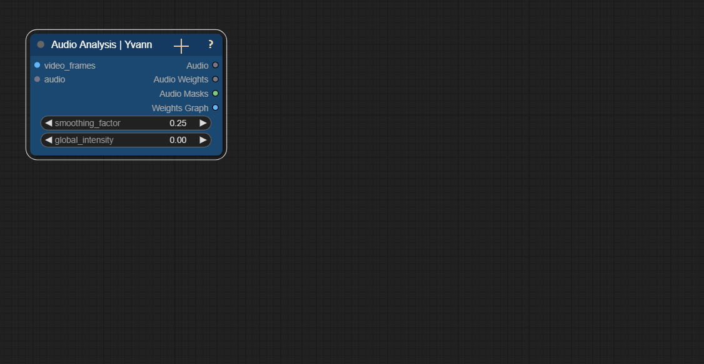

# 👁️ ComfyUI_Yvann-Nodes   

### **With this pack of nodes, you can analyze audio, extract drums and vocal tracks, and use this information to create audio-reactive animations in your ComfyUI workflows**
---

**`Audio Analysis 🔊`**

**`Audio Drums Analysis 🥁`**

**`Audio Vocals Analysis 🗣️`**

---

**`For detailed information, click the ❔ icon on any of my nodes`**

---

## Installation
1. Install [ComfyUI](https://github.com/comfyanonymous/ComfyUI) & [ComfyUI-Manager](https://github.com/ltdrdata/ComfyUI-Manager)
2. Launch ComfyUI
3. Click on "🧩 Manager" -> "Custom Nodes Manager"
4. Search for `ComfyUI_Yvann-Nodes` in the manager and install it

---

## Contributing 🙌  
Want to help make this project better? Feel free to:

- Open an issue
- Submit a pull request
- Reach out to me on [LinkedIn](https://www.linkedin.com/in/yvann-barbot/) or via email at [barbot.yvann@gmail.com](mailto:barbot.yvann@gmail.com)
